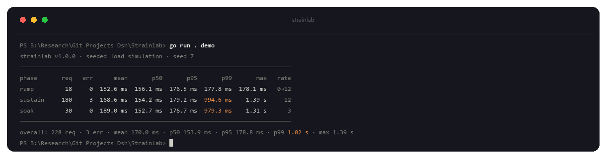
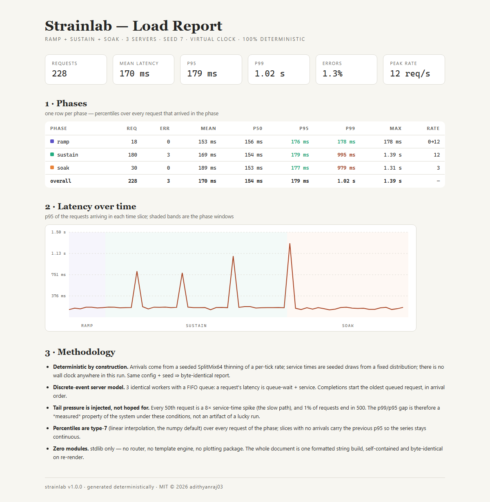

<p align="center">
  
</p>

<h3 align="center">Strainlab — reproducible load testing, built from scratch</h3>

<p align="center">
  
  
  
  
  
</p>

<p align="center">
  <b>Load tests are the one benchmark you can never rerun — every run hits a different machine, a different day.</b><br>
  Strainlab rebuilds load testing in Go around a seeded virtual clock: the same
  config + seed produces the same requests, the same queue, the same report.
  No k6, no locust, no third-party module.
</p>

---

## What this is

Load testing has two jobs, and they need different honesty:

- **Characterize a system under load** — where does latency start to bend,
  what does the p99 do when a slow path appears? For this you want a
  *reproducible* run: one you can re-run, diff, and put in a regression suite.
- **Probe a real endpoint** — does *this* deployment, on *this* network, hold
  up? For this you want *measured* numbers, and you must not pretend they
  weren't measured.

Strainlab does both, and keeps them apart:

- **`prng`** — SplitMix64 (known-answer tested against the VecLab Rust
  reference — the same stream across two languages) with uniform, integer, and
  exponential draws
- **`stats`** — count/min/max/mean/p50/p95/p99 over a sample; type-7
  (linear-interpolation) percentiles, the numpy default
- **`sim`** — a discrete-event load simulation on a seeded virtual clock:
  ramp/sustain/soak arrival phases, an N-server FIFO queue, injected
  slow-path spikes and injected error rate. The result is a pure function of
  (config, seed) — no wall clock anywhere in it
- **`report`** — a single-file HTML report: summary cards, per-phase table,
  p95-over-time chart, methodology. Byte-identical on re-render
- **`target`** — a deterministic offline HTTP server: every Nth request 500s,
  every Mth request takes a seeded long time. Same seed, same behaviour
- **`run`** — the measured mode: a real HTTP probe with a worker pool,
  recorded to JSONL, explicitly labelled `MEASURED, not seeded`

## The simulation

Time is a counter, not a clock. Each tick (10 ms virtual) draws arrivals by
thinning the phase's per-second rate from the seeded stream; each request
draws its service time from `base · (1 + jitter · u)`, with every 50th request
multiplied by 8× (the injected slow path) and 1% of requests failing.

Servers are identical workers behind a FIFO queue: a request's latency is
queue-wait + service, completions start the oldest queued request, and a
completion that finds the queue non-empty starts the next one immediately —
the event loop only advances when the oldest event is due.

The standard run (seed 7): 3 servers, 120 ms base service ± 50% jitter,
3 s ramp 0→12 req/s, 15 s sustain at 12 req/s, 10 s soak at 3 req/s. That is
utilization ρ ≈ 0.6 — deliberately near-saturated, where queueing theory says
the tail starts to matter but the queue still drains.

```
$ go run ./cmd/strainlab demo
phase       req   err      mean       p50       p95       p99       max   rate
ramp         18     0  152.6 ms  156.1 ms  176.5 ms  177.8 ms  178.1 ms   0→12
sustain     180     3  168.6 ms  154.2 ms  179.2 ms  994.6 ms    1.39 s     12
soak         30     0  189.0 ms  152.7 ms  176.7 ms  979.3 ms    1.31 s      3
overall: 228 req · 3 err · mean 170.0 ms · p50 153.9 ms · p95 178.8 ms · p99 1.02 s · max 1.39 s
```

<p align="center">
  
</p>

Read that table:

- **p50 ≈ service time** — 154 ms against 120–180 ms of seeded service: at
  ρ ≈ 0.6 the median request barely waits. The queue is shallow.
- **p95 is mild queueing** — 179 ms, a few tens of milliseconds of wait above
  the median. Normal load, normal price.
- **p99 is the injected spike** — 994 ms ≈ 8× service. That gap is not a lucky
  run: it is a *measured property of the system under these conditions*.
  Remove the spike flag and the p99 collapses back toward the p95.
- **The soak's p99 stays at the spike level** even at 3 req/s: tail latency
  is driven by the slow path, not by the load.

## Quickstart

```bash
go build -o strainlab ./cmd/strainlab

# the standard seeded simulation (ramp + sustain + soak)
go run ./cmd/strainlab demo

# the same run, every flag overridable
go run ./cmd/strainlab simulate --servers 4 --base 0.08 --spike-every 25 --spike-mul 6 --seed 3

# render the run as a single-file HTML report
go run ./cmd/strainlab report --out report.html

# the deterministic offline target
go run ./cmd/strainlab serve --listen 127.0.0.1:8765 --base 120ms

# probe a real endpoint (MEASURED, not seeded)
go run ./cmd/strainlab run --url http://127.0.0.1:8765/load --rps 5 --secs 6 --out results.jsonl

# the test suite
go test ./...
```

## The offline target and the measured probe

`serve` starts a target with no dependencies to hit: `/healthz` is cheap,
`/load` sleeps a seeded duration (base ± jitter, with the same spike
every-Mth-request behaviour as the simulation) and 500s every FailMod-th
request. Because the seed fixes the behaviour of request *i* for all i, two
targets with the same seed are indistinguishable — the tests assert exactly
that.

`run` is the honest counterpart: a real HTTP client with a worker pool at a
target rate, every response recorded to JSONL with its timestamp, latency,
and status. Its output header says what it is:

```
strainlab v1.0.0 · probing http://127.0.0.1:8765/load at 5.0 req/s for 6.0 s (MEASURED, not seeded)
```

A probe result is a statement about *this machine at this moment* — so it is
never mixed into the deterministic report, and never pretends to be reproducible.

## The report

`report` renders the standard run as a single self-contained HTML document:

- **Summary cards** — requests, mean, p95, p99, error rate, peak rate
- **Per-phase table** — percentiles over every request that arrived in the
  phase, with a p95/p50 heat grade per cell
- **p95 over time** — 60 time slices with phase bands; the sawtooth *is* the
  spike injection, visible in the geometry
- **Methodology** — determinism, queue model, injection, percentiles, zero modules

<p align="center">
  
</p>

<p align="center"><sub><b>Sample report</b> — rendered from the standard run via <code>report --out report.html</code>.</sub></p>

No external assets, no script tags, prints clean, byte-identical on re-run.

## Tests

59 offline tests, no network (the HTTP tests use `httptest` in-process), no
wall-clock dependence:

- **prng** — SplitMix64 known-answer tests against the same reference values
  the VecLab Rust crate uses (the stream is verified across two languages),
  same-seed bit-identity, range and residue coverage, exponential mean
- **stats** — percentile edge cases (empty, single, endpoints), the type-7
  values on 1..10, order-insensitivity, error pass-through
- **sim** — controlled systems (single-server p50 ≈ service time, FIFO burst
  monotonicity), determinism at the request level, seeds that change the
  run, count conservation, phase alignment, latency/service invariants,
  exact spike placement, 50% error rate within band, empty phases, an
  over-utilized run that still drains
- **report** — document structure, byte-identical re-render, every reported
  percentile present verbatim, no external references, empty-run guard
- **target** — health endpoint, work response, failure injection pattern,
  per-index determinism across identically-seeded targets, duration parsing
- **run** — in-process round trip, argument validation, valid JSONL output,
  server-error counting, sample ordering
- **main** — usage text, version, flag defaults tracking `DemoConfig()`

```bash
go test ./...
```

## Design notes

- **The wall clock is the enemy of a benchmark.** Every input to the
  simulation — arrivals, service times, failures, spikes — comes from one
  seeded SplitMix64 stream. Same config + seed ⇒ identical requests,
  identical queue, byte-identical report. The test suite asserts the request
  level, not just the summary.
- **Tail pressure is injected, not hoped for.** Real load tests find a bad
  day and you re-run forever. Here the p99/p95 gap is a designed input:
  every 50th request takes 8× service, 1% fail. If your queue can't absorb
  an 8× slow request at 60% utilization, that's a *result* you can show.
- **The engine is checked against queueing theory.** Before tuning the
  standard config, the simulation was validated on controlled systems:
  one, constant service, low utilization ⇒ p50 equals the service
  time; a burst ⇒ strictly FIFO completions. A first draft config with
  ρ &gt; 1 (2 servers, 10× spikes every 40th request) produced an
  unbounded queue — the engine surfaced it honestly as p50 ≈ 1 s, and the
  config was retuned, not the arithmetic.
- **Measured stays measured.** The probe mode exists because real endpoints
  exist, but its output is stamped `MEASURED, not seeded` and kept out of
  the deterministic report. Two kinds of numbers, two kinds of claims.
- **Zero modules.** stdlib only — no router, no template engine, no plotting
  package, no PRNG. The PRNG is hand-rolled SplitMix64 shared with VecLab,
  so a seeded run here and a seeded run there draw the same first values.
  `go.mod` declares a module and nothing else.

## Roadmap

- A multi-endpoint target (weighted routes, header echo) for richer probe patterns
- Quantile tracking of the measured probe (p50/95/99 from the JSONL stream)
- A deterministic diff between two seeded runs (which requests moved, by how much)
- Export of the request trace (arrival/service/complete per request) for external tooling

---

`© 2026 Adithya N Raj`
